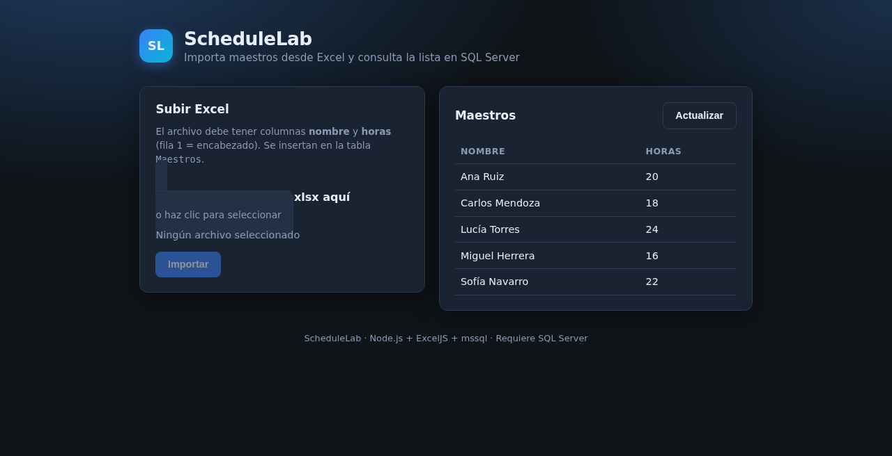

# ScheduleLab

**Demo:** https://joshuadh1409.github.io/schedulelab/

Importa maestros desde un Excel (`.xlsx`) a SQL Server y lista el resultado en una UI mínima.

<!-- screenshots -->
## Vista




## Qué hace

1. UI estática en `public/` para subir el Excel y ver maestros
2. `POST /upload` — parsea con ExcelJS e inserta en la tabla `Maestros`
3. `GET /maestros` — listado desde SQL Server (`mssql`)

Servidor en `server.js` (HTTP nativo; Express está en deps pero no se usa aquí).

## Stack

- Node.js (HTTP nativo)
- mssql
- ExcelJS
- formidable
- dotenv

## Requisitos

- Node.js 18+
- SQL Server con tabla `Maestros` (`nombre`, `horas_disponibles`)
- `.env` local (no versionado)

## Cómo ejecutar

```bash
npm install
cp .env.example .env
# DB_USER, DB_PASS, DB_SERVER, DB_NAME
node server.js
```

Abre http://localhost:3000

```
DB_USER=
DB_PASS=
DB_SERVER=
DB_NAME=
```

## Formato del Excel

| nombre   | horas |
|----------|-------|
| Ana Ruiz | 20    |

La primera fila es encabezado.

## Estructura

```
server.js
config/db.js
utils/importExcel.js
public/index.html
uploads/          # temporal, ignorado en git
.env.example
package.json
```

## Limitaciones

- Sin SQL Server fallan `/maestros` y la importación
- Es importación, no un generador completo de horarios
- Sin auth ni validación avanzada del Excel

## Licencia

MIT
